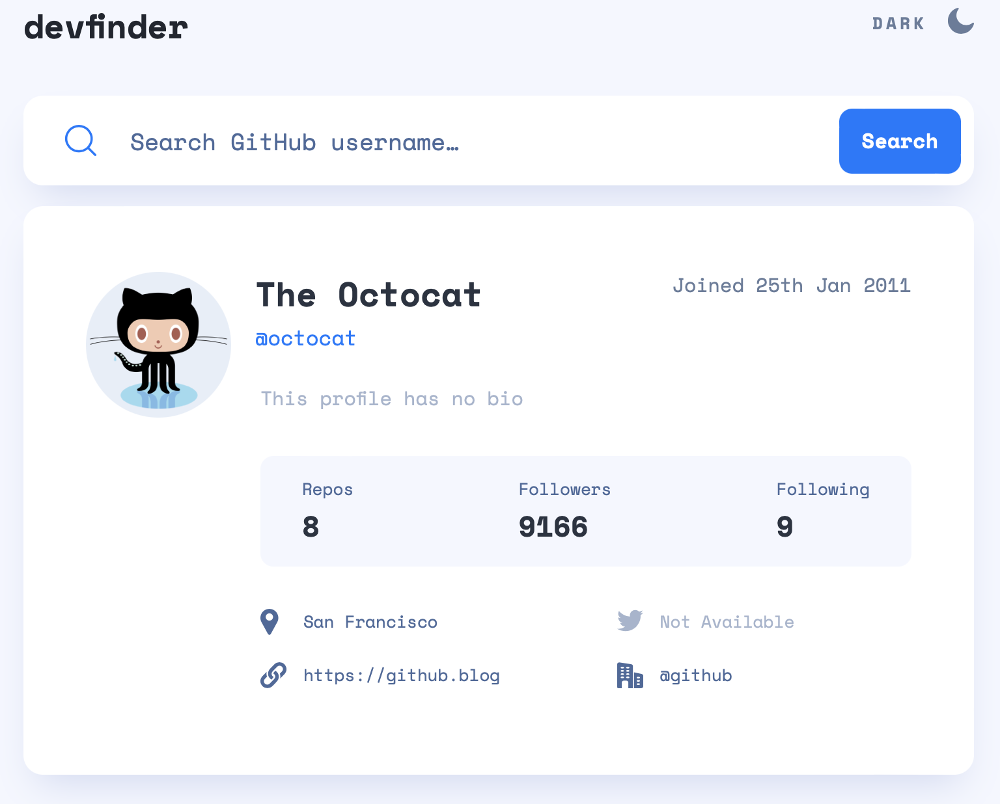
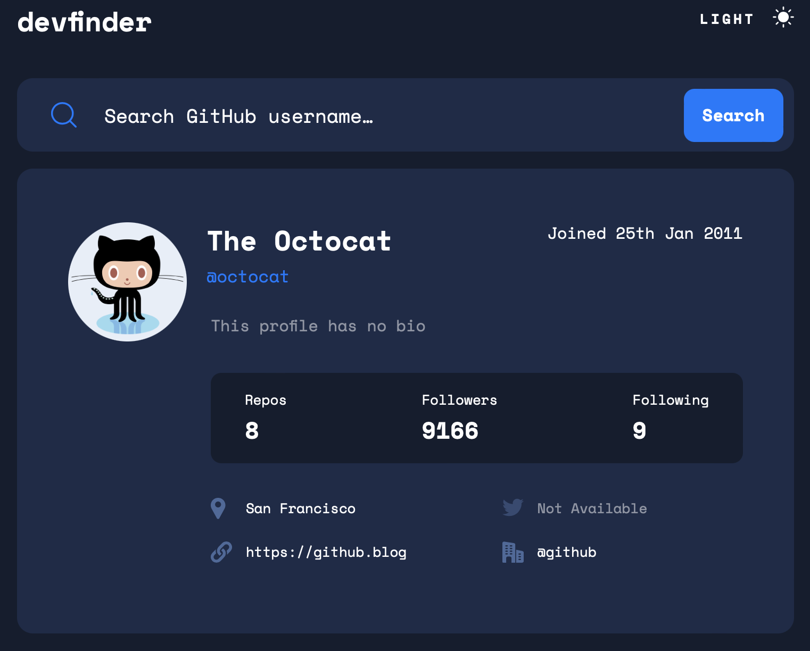
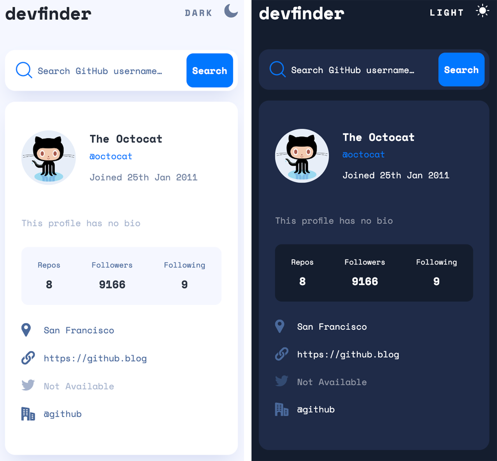
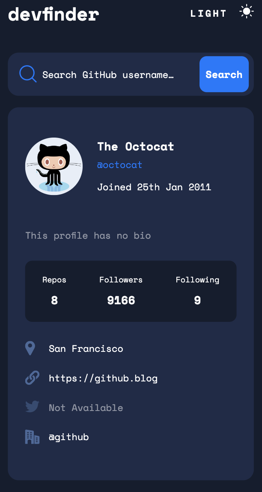

# Frontend Mentor - GitHub user search app solution

This is a solution to the [GitHub user search app challenge on Frontend Mentor](https://www.frontendmentor.io/challenges/github-user-search-app-Q09YOgaH6). Frontend Mentor challenges help you improve your coding skills by building realistic projects.a

## Table of contents

- [Frontend Mentor - GitHub user search app solution](#frontend-mentor---github-user-search-app-solution)
  - [Table of contents](#table-of-contents)
  - [Overview](#overview)
    - [The challenge](#the-challenge)
    - [Screenshot](#screenshot)
    - [Links](#links)
  - [My process](#my-process)
    - [Built with](#built-with)
    - [What I learned](#what-i-learned)
  - [Author](#author)

## Overview

### The challenge

Users should be able to:

- View the optimal layout for the app depending on their device's screen size
- See hover states for all interactive elements on the page
- Search for GitHub users by their username
- See relevant user information based on their search
- Switch between light and dark themes
- **Bonus**: Have the correct color scheme chosen for them based on their computer preferences. _Hint_: Research `prefers-color-scheme` in CSS.

### Screenshot

Desktop :



Mobile :



### Links

- Live Site URL: [https://github-user-search-app-candyfair.vercel.app](https://github-user-search-app-candyfair.vercel.app)

## My process
I started by setting up a React environment with Redux. Working from the Figma design files, I first identified each component, I structured them and I styled them, using a main styling SCSS file for general and recurrent styles, and an individual SCSS file for each component as needed. For this part, I styled for mobile first. Once the styling was over, I coded each interaction using Redux with a store, different states, actions and reducers. I then deployed the web app on [Vercel](https://vercel.com).

### Built with

- Semantic HTML5 markup
- Flexbox
- Mobile-first workflow
- [SASS/SCSS](https://sass-lang.com) - CSS extension language
- [React](https://reactjs.org/) - JS library
- [Redux](https://redux.js.org) - Predictable State Container for JS Apps

### What I learned

This challenge was the occasion to understand how to pass a variable from a React component to the API call :

1.  In my component, I referenced my input field through `useRef` and named it `searchInputRef`. I then dispatched its value through the action `fetchUser` sent to the middleware that calls the API :

```js
const searchValue = searchInputRef.current.value;
dispatch(fetchUser(searchValue));
```

2. In the middleware, I then  used the variable with `${action.value}` directly in the API url :

```js
...
case FETCH_USER:
  next(action);

  api.get(
    `/${action.value}`,
  )
    .then()
    .catch()
...
```


## Author

- Website - [Candice Fairand's web dev portfolio](https://www.candicefairand.com/)
- Frontend Mentor - [@Candyfair](https://www.frontendmentor.io/profile/Candyfair)
- Twitter - [@candy-fair](https://twitter.com/candy_fair)

